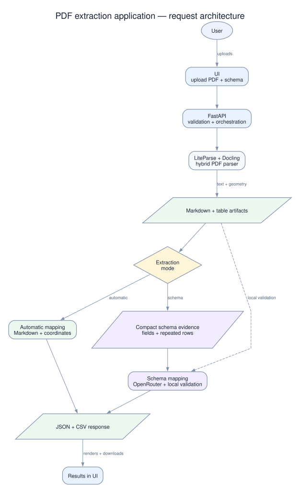

# Application architecture

This diagram describes the current PDF-to-structured-data application. It
uses a manually composed left-to-right layout so the request path, extraction
branches, external model boundary, and browser review loop remain readable on
a normal documentation page. Uploaded PDFs and schemas are processed in
memory and in temporary working directories; the application does not persist
user uploads.

## Overview

The SVG is the authoritative presentation artifact. The older
[application-architecture.dot](application-architecture.dot) file is retained
as a rough editable reference; it is not used to generate the current layout.

## Primary data flow

1. The user uploads a PDF in the web workspace and chooses automatic extraction
   or schema extraction. A schema file is read in the browser and validated by
   the API before extraction.
2. The extraction API validates the PDF signature, size, and page count, then
   runs one bounded extraction request. Parsing first tries native text; when
   native parsing fails, the complete parse is retried with OCR enabled.
3. The hybrid parser combines document text with table structure and PDF
   coordinates. The merged Markdown is the shared source representation, while
   the table artifact retains geometry and cell-level evidence.
4. Automatic extraction maps fields and tables deterministically, preserving
   uncertain or unlabeled content for review. Schema extraction removes parser
   internals and long prose, then sends the user-defined field contract plus
   compact label/value, table-row, ambiguous, and short-text candidates to the
   external language model service. The complete Markdown stays local.
5. Schema mappings are checked against the processed source, normalized into
   the response contract, and converted to CSV. The API returns JSON, CSV,
   page-count, timing, and processing metadata for the review and export UI.

### Schema contract

Schema uploads define document fields and may define one repeated `table` or
`records` collection. Each collection can represent rows from multiple table
sections or continuation pages; source order and any declared context fields
are retained so rows remain associated with the correct section.

## Components and responsibilities

| Component | Responsibility | Current implementation boundary |
| --- | --- | --- |
| Web workspace | Upload PDF, choose mode, upload schema, display results, download JSON/CSV | `frontend/app/page.tsx` and `frontend/components/` |
| Extraction API | Validate requests, limit concurrent work, invoke extraction, assemble the response | `backend/main.py` |
| Request and schema validation | Enforce PDF limits and validate the schema contract | `backend/main.py`, `backend/extraction_schema.py` |
| Hybrid document parser | Produce merged Markdown plus table artifacts; support native parsing and OCR retry | `backend/hybrid_pdf_to_md.py`, `backend/docling_tables.py` |
| Deterministic automatic mapper | Map fields and tables from structure and coordinates without model calls; retain review evidence | `backend/automatic_extraction.py` |
| Schema-driven extractor | Compact parsed evidence, map it to requested fields with the model, then validate and normalize the response | `backend/schema_extractor.py` |
| Output assembler | Create the JSON result and flat CSV convenience output | `backend/main.py`, `backend/schema_extractor.py` |
| Review and export | Present mapped fields, tables, review items, JSON, and downloads | `frontend/components/results.tsx`, `frontend/components/export-menu.tsx` |

## Correctness-sensitive design decisions

- **Source fidelity:** schema extraction treats model output as a candidate
  location, not trusted data. Non-empty values must be supported by the
  processed Markdown, and printed spelling and formatting are preserved.
- **Bounded model input:** the external model receives the schema and compact
  extracted candidates, not the original PDF or complete Markdown. Page and
  source-line order retain the context needed to align repeated table groups.
- **Schema portability:** field names are user-defined aliases, while the
  processed source supplies the labels and table geometry needed to map them.
  This lets the same extraction path handle differently labeled certificates
  without coupling the application to one document layout.
- **Evidence reconciliation:** the automatic path combines Markdown structure
  with Docling table geometry and coordinates. Low-confidence relationships,
  duplicate content, and unlabeled source text remain visible for review
  instead of being silently discarded.
- **Parser resilience:** native extraction is preferred for ordinary PDFs. If
  it produces unusable text or fails, the full pipeline is rerun with OCR so
  text and table evidence come from the same parsing mode.

## Main source files

- [README.md](../README.md) — product behavior, limits, and extraction modes
- [backend/main.py](../backend/main.py) — API boundary and orchestration
- [backend/hybrid_pdf_to_md.py](../backend/hybrid_pdf_to_md.py) — parser merge boundary
- [backend/automatic_extraction.py](../backend/automatic_extraction.py) — deterministic mapping
- [backend/schema_extractor.py](../backend/schema_extractor.py) — model call and source validation
- [docs/automatic-field-mapping-plan.md](automatic-field-mapping-plan.md) — automatic mapping invariants
